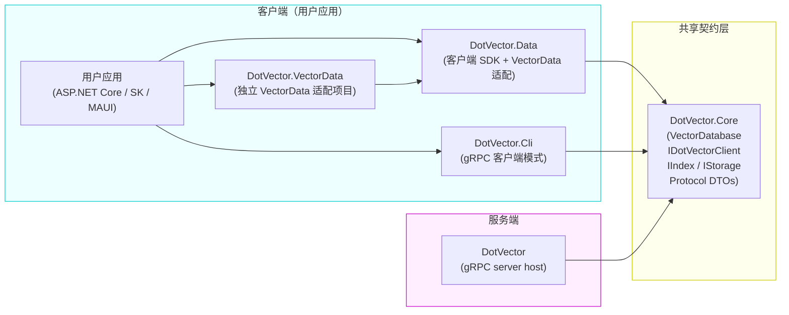
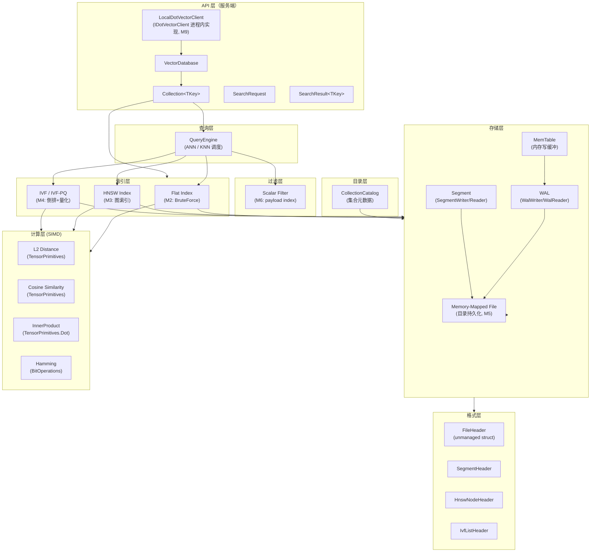

# DotVector 架构总览

本文档描述 DotVector 的整体架构分层设计，以及**客户端/服务端分离**原则。

---

## 项目依赖关系



**关键约束**：
- `DotVector.Data`（客户端）**禁止**直接引用 `DotVector`（服务端）
- 二者只通过 `DotVector.Core` 中的 `IDotVectorClient` 接口通信
- 传输实现（gRPC / 进程内）在运行时注入，对 `DotVector.Data` 透明

---

## 系统分层图（服务端内部）



---

## 层次职责

### 共享契约层（`src/DotVector.Core/`）

嵌入式数据库引擎与跨客户端/服务端边界的协议类型都在此定义。

| 类型 | 职责 |
|------|------|
| `VectorDatabase` | 嵌入式数据库实例，一个实例对应一个内存数据库或 `.dvec/` 目录 |
| `Collection<TKey>` | 单个集合，封装索引、payload、过滤、flush 与恢复 |
| `LocalDotVectorClient` | 实现 `IDotVectorClient`，进程内直接调用 `VectorDatabase`，供嵌入式和服务端委托使用 |
| `IDotVectorClient` | 客户端协议抽象，定义所有操作契约（Create / Upsert / Delete / Search / Ping） |
| `IIndex<TKey>` | 向量索引抽象（服务端内部） |
| `IStorage` | 持久化存储抽象（服务端内部） |
| `IDistanceKernel<T>` | 距离计算内核抽象 |
| `Protocol/ProtocolDtos.cs` | 协议 DTO：`CreateCollectionRequest` / `VectorUpsertRecord` / `VectorSearchRequest` / `VectorSearchResult` |

### 客户端适配层（`src/DotVector.Data/`）

发布用客户端 SDK。提供高层 `DotVectorClient`、`GrpcDotVectorClient`、嵌入式工厂，以及 `Microsoft.Extensions.VectorData.Abstractions` 适配（M7）。

**不引用** `DotVector`（服务端）程序集。

```
DotVector.Data
    ↓ 依赖
DotVector.Core（IDotVectorClient + Protocol DTOs）
    ↑ 实现（运行时注入）
GrpcDotVectorClient（M9，位于 DotVector.Data）
LocalDotVectorClient（M9，位于 DotVector.Core，供进程内嵌入式使用）
```

### 独立 VectorData 适配（`src/DotVector.VectorData/`）

保留的独立 VectorData 适配项目，源码与 `DotVector.Data` 适配层保持接近，用于兼容演进和未来拆分。当前主要发布门面是 `DotVector.Data`。

### 服务端宿主（`src/DotVector/`）

独立可执行的 gRPC 服务端壳。它托管多个 `DotVector.Core.VectorDatabase` 实例，每个数据库对应一个 `.dvec/` 目录，并通过 gRPC 暴露远程访问能力。

| 类型 | 职责 |
|------|------|
| `DotVectorServer` | 构建 Kestrel HTTP/2 gRPC 宿主 |
| `VectorServiceImpl` | Protobuf/gRPC DTO 与 Core 协议 DTO 的转换层 |
| `DotVectorDatabaseRegistry` | 根据 database selector 维护多个本地数据库实例 |

### 索引层（`src/DotVector.Core/Index/`）

| 索引 | Milestone | 算法 |
|------|-----------|------|
| `FlatIndex<TKey>` | M2 | 线性扫描（精确） |
| `HnswIndex<TKey>` | M3 | HNSW 图（近似） |
| `IvfFlatIndex<TKey>` | M4 | IVF 倒排文件（近似） |
| `IvfPqIndex<TKey>` | M4 | IVF + 乘积量化（压缩） |
| `VamanaIndex<TKey>` | M12 | DiskANN / Vamana 单层图 |

### 计算层（`src/DotVector.Core/Compute/`）

所有距离函数的 SIMD 加速实现，基于 `TensorPrimitives` 与 `Vector<T>` / `Vector512<T>`。同时保留 `IBatchScorer` 注入点，CE 默认实现为 `CpuTensorPrimitivesScorer`。

### 存储层（`src/DotVector.Core/Storage/` + `Wal/`）

负责数据持久化（M5 后启用）：
- `MemTable` — 内存写缓冲，写满后 flush 到 Segment
- `WalWriter/WalReader` — 崩溃安全的预写日志
- `SegmentWriter/Reader` — 不可变数据段，基于 mmap
- `ScalarIndex` / `PayloadCodec` — payload 持久化与标量过滤下推（M11）

### 量化层（`src/DotVector.Core/Compression/`）

`IVectorQuantizer` 抽象统一 SQ8、PQ、OPQ、RQ，并通过 `QuantizerSerializer` 将可选 `quantizer.bin` sidecar 持久化到 Segment 中。

### 格式层（`src/DotVector.Core/Format/`）

所有 `unmanaged struct`，字节序 little-endian，`[StructLayout(Sequential, Pack=1)]`。

**持久化采用单目录方案**（`.dvec/`），每个 Segment 是独立文件，可以独立 mmap。与 LanceDB Fragment、RocksDB SST 的做法一致，性能优于单文件。

```
目录布局（M5）：
my-database.dvec/
├── catalog.bin                 # FileHeader + CollectionHeader[]（unmanaged struct）
├── wal/
│   ├── wal-000001.log          # WAL 段：顺序追加，每条 entry 含 CRC
│   └── wal-000002.log          # 旧 WAL 在 flush 后截断删除
└── collections/
    └── {collection-id}/
        └── segments/
            ├── seg-000001/
            │   ├── seg.hdr     # SegmentHeader：向量数、维度、创建时间戳
            │   ├── vectors.bin # float32[N][dim]，行优先，直接 mmap
            │   ├── payload.bin # 可选 payload sidecar
            │   ├── quantizer.bin # 可选量化器 sidecar
            │   └── vamana.bin  # Vamana / DiskANN 图 sidecar
            └── seg-000002/
                └── ...
```

---

## 数据流示意

### 远程访问（gRPC，M9）

```
用户应用
  → DotVector.Data（IVectorStore）
    → GrpcDotVectorClient（IDotVectorClient）
      → [gRPC 传输]
        → DotVector（gRPC server）
          → VectorDatabase.Search(...)
            → QueryEngine → HnswIndex → Compute.Distance
```

### 进程内嵌入式访问（M9）

```
用户应用（直接引用 DotVector.Core）
  → VectorDatabase.CreateCollection(...)
  → Collection.Search(queryVec, topK=10)
    → QueryEngine → HnswIndex → TensorPrimitives.CosineSimilarity
```

### 通过 VectorData 接口的进程内访问（M9）

```
用户应用（SK / Semantic Kernel）
  → IVectorStore（DotVectorVectorStore）
    → IDotVectorClient（LocalDotVectorClient）
      → VectorDatabase [进程内，零序列化]
        → QueryEngine → HnswIndex → Compute
```

---

## 并发模型

- 写操作：单写者模型（`ReaderWriterLockSlim`）
- 读操作：多读者并发（无锁读 mmap 数据）
- 索引构建（M3 HNSW）：后台线程，读写分离

---

## AOT 兼容性

所有生产代码启用 `IsAotCompatible=true`。关键约束：
- 热路径避免运行时反射，VectorData 映射通过明确的 trim/AOT 注解隔离风险
- 泛型约束明确（`where T : unmanaged`）
- Protocol DTOs 不依赖运行时反射序列化（M9 gRPC 用 source-generated marshalling）
