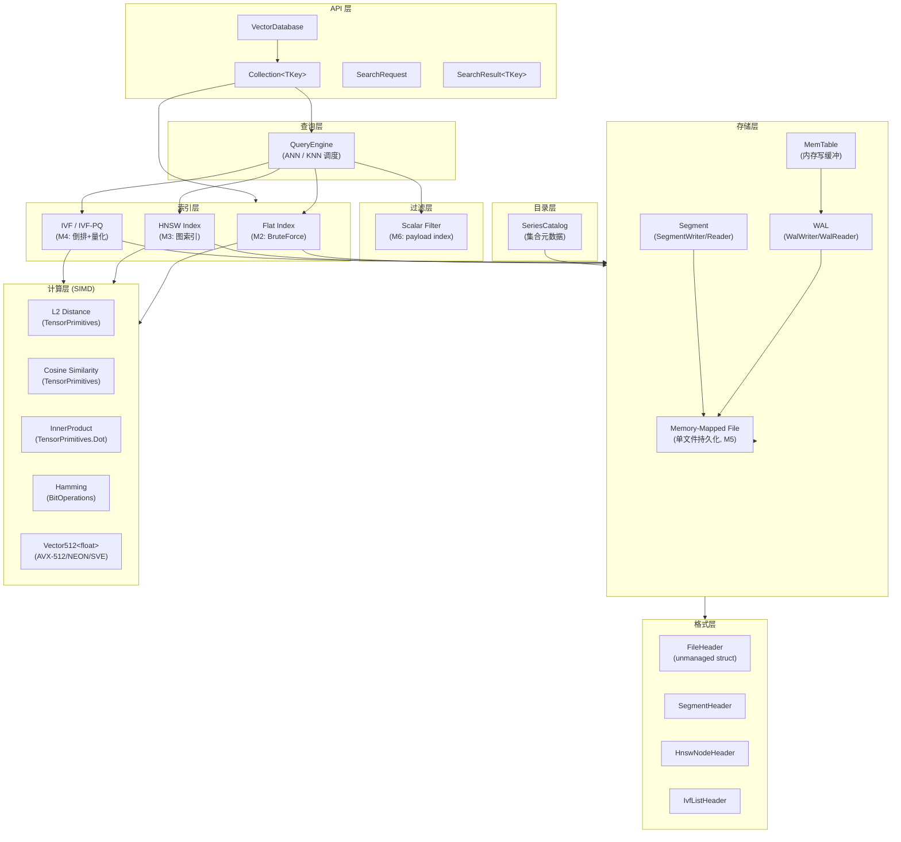

# DotVector 架构总览

本文档描述 DotVector 的整体架构分层设计。

---

## 系统分层图



---

## 层次职责

### API 层（`src/DotVector/Api/`）

对外暴露的顶层 API，是用户直接使用的入口点。

| 类型 | 职责 |
|------|------|
| `VectorDatabase` | 数据库实例，管理多个 Collection |
| `Collection<TKey>` | 单个向量集合，封装索引 + 存储 |
| `SearchRequest` | 搜索请求参数（向量、topK、过滤条件） |
| `SearchResult<TKey>` | 单条搜索结果（Key、Score、Payload） |

### 索引层（`src/DotVector/Index/`）

实现各种 ANN 索引算法：

| 索引 | Milestone | 算法 |
|------|-----------|------|
| `FlatIndex<TKey>` | M2 | 线性扫描（精确） |
| `HnswIndex<TKey>` | M3 | HNSW 图（近似） |
| `IvfFlatIndex<TKey>` | M4 | IVF 倒排文件（近似） |
| `IvfPqIndex<TKey>` | M4 | IVF + 乘积量化（压缩） |

### 计算层（`src/DotVector/Compute/`）

所有距离函数的 SIMD 加速实现，基于 `TensorPrimitives` 与 `Vector512<T>`。

无任何 IO 或状态，纯函数设计，方便测试。

### 存储层（`src/DotVector/Storage/` + `Wal/`）

负责数据持久化（M5 后启用）：
- `MemTable` — 内存写缓冲，写满后 flush 到 Segment
- `WalWriter/WalReader` — 崩溃安全的预写日志
- `SegmentWriter/Reader` — 不可变数据段，基于 mmap

### 格式层（`src/DotVector/Format/`）

所有 `unmanaged struct`，字节序 little-endian，`[StructLayout(Sequential, Pack=1)]`。

**持久化采用单目录方案**（`.dvec/`），每个 Segment 是独立文件，可以独立 mmap。与 LanceDB Fragment、RocksDB SST 的做法一致，性能优于单文件。

```
目录布局（M5）：
my-database.dvec/
├── catalog.bin                 # FileHeader + CollectionHeader[]（unmanaged struct）
├── wal/
│   ├── wal-000001.log          # WAL 段：顺序追加，每条 entry 含 CRC
│   └── wal-000002.log          # 旧 WAL 在 flush 后截断删除
└── collections/
    └── {collection-id}/
        └── segments/
            ├── seg-000001/
            │   ├── seg.hdr     # SegmentHeader：向量数、维度、创建时间戳
            │   ├── vectors.bin # float32[N][dim]，行优先，直接 mmap
            │   └── index.bin   # 索引序列化（HNSW 邻居表 / IVF 倒排列表）
            └── seg-000002/
                └── ...

优势（对比单文件）：
  - 每个 vectors.bin 独立 MemoryMappedFile → OS 精确管理页面生命周期
  - Segment 间并行 IO（多 mmap fd）
  - Compaction 只替换涉及的 Segment 目录（原子 rename）
  - 崩溃恢复：WAL 独立文件，Segment 原子提交
```

### 接口层（`src/DotVector.Core/`）

定义 `IIndex<TKey>`、`IStorage`、`IDistanceKernel<T>` 等接口，供依赖注入和测试 mock 使用。

### VectorData 适配层（`src/DotVector.Data/`）

实现 `Microsoft.Extensions.VectorData.Abstractions` 接口，与 Semantic Kernel 集成（M7）。

---

## 数据流示意

### 写入流程

```
Insert(key, vector, payload)
  → Collection.Insert
    → MemTable.Add
      → WalWriter.Append (M5)
        → [background flush]
          → SegmentWriter.Flush
            → mmapped file
  → HnswIndex.Add (M3) / FlatIndex.Add (M2)
```

### 搜索流程

```
Search(queryVector, topK, filter)
  → QueryEngine.Search
    → ScalarFilter.Evaluate (M6)
    → HnswIndex.Search / FlatIndex.Search
      → Compute.Distance (TensorPrimitives)
    → merge + rerank
    → return SearchResult[]
```

---

## 并发模型

- 写操作：单写者模型（`ReaderWriterLockSlim`）
- 读操作：多读者并发（无锁读 mmap 数据）
- 索引构建（M3 HNSW）：后台线程，读写分离

---

## AOT 兼容性

所有生产代码（`src/DotVector`、`src/DotVector.Core`、`src/DotVector.Cli`）启用 `IsAotCompatible=true`。

关键约束：
- 不使用 `Activator.CreateInstance` 或反射
- 泛型约束明确（`where T : unmanaged`）
- `[DynamicallyAccessedMembers]` 标注（如有需要）
