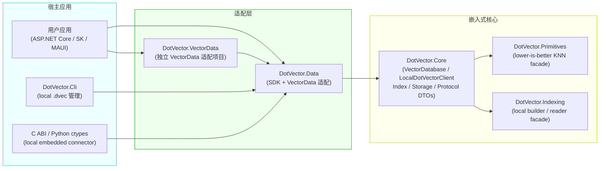
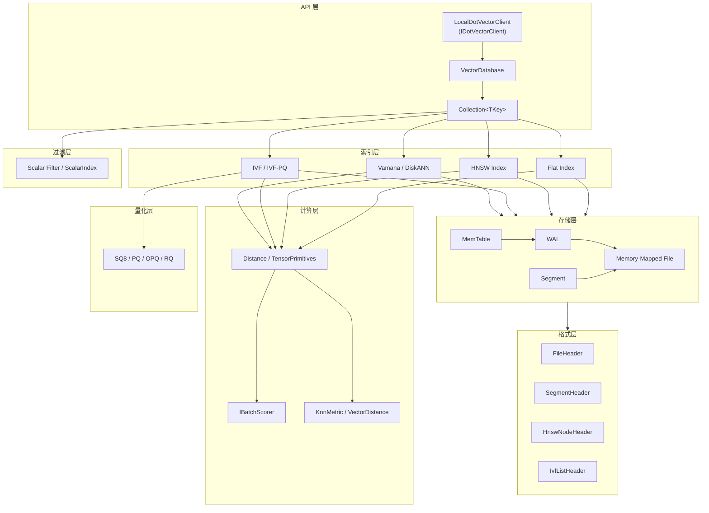

# DotVector 架构总览

本文档描述 DotVector 当前的嵌入式架构分层，以及 SonnetDB 集成时的库级边界。

---

## 项目依赖关系



**关键约束**：

- DotVector 独立 gRPC Server / Docker 服务端项目已删除。
- `DotVector.Data` 只提供本地嵌入式 SDK 与 VectorData 适配。
- 需要服务端 endpoint 时由 SonnetDB 承载 API、认证、过滤、WAL、Segment、备份恢复和部署生命周期。
- SonnetDB adapter 只依赖 `DotVector.Primitives` / `DotVector.Indexing` 这类库级能力，不依赖 DotVector 独立数据库服务。

---

## 系统分层图



---

## 层次职责

### 嵌入式核心（`src/DotVector.Core/`）

| 类型 | 职责 |
|------|------|
| `VectorDatabase` | 嵌入式数据库实例，一个实例对应一个内存数据库或 `.dvec/` 目录 |
| `Collection<TKey>` | 单个集合，封装索引、payload、过滤、flush 与恢复 |
| `DotVectorDbContext` | Code-First 嵌入式上下文，自动绑定 `DotVectorSet<TEntity>` 到 `VectorDatabase` |
| `DotVectorSet<TEntity>` | Code-First 实体集合，支持一个实体映射多个向量字段集合 |
| `LocalDotVectorClient` | 实现 `IDotVectorClient`，进程内直接调用 `VectorDatabase` |
| `IDotVectorClient` | SDK / VectorData 适配层的本地协议抽象 |
| `IIndex<TKey>` | 向量索引抽象 |
| `IDistanceKernel<T>` | 距离计算内核抽象 |
| `Protocol/ProtocolDtos.cs` | SDK 内部 DTO：`CreateCollectionRequest` / `VectorUpsertRecord` / `VectorSearchRequest` / `VectorSearchResult` |

### 客户端适配层（`src/DotVector.Data/`）

客户端 SDK 项目，NuGet 包名为 `DotVector`。提供高层 `DotVectorClient`、`Embedded(path)` 本地工厂，以及 `Microsoft.Extensions.VectorData.Abstractions` 适配。

```text
DotVector.Data
    ↓ 依赖
DotVector.Core（IDotVectorClient + Protocol DTOs）
    ↑ 实现
LocalDotVectorClient（进程内嵌入式）
```

`DotVectorClient.Connect(...)` 和 C ABI `dotvector_database_connect` 仅保留兼容符号，调用时明确返回“不支持远程服务端模式”。

### 独立 VectorData 适配（`src/DotVector.VectorData/`）

保留的独立 VectorData 适配项目，源码与 `DotVector.Data` 适配层保持接近，用于兼容演进和未来拆分。当前主要发布门面是 `DotVector` NuGet 包。

### CLI 与连接器

| 项目 | 职责 |
|------|------|
| `DotVector.Cli` | Native AOT 命令行工具，打开本地 `.dvec/` 目录进行集合管理 |
| `connectors/c/native` | NativeAOT C ABI，暴露本地嵌入式句柄和 JSON payload/filter 协议 |
| `connectors/python` | Python ctypes Native 客户端，复用 C ABI |

### 索引层（`src/DotVector.Core/Index/`）

| 索引 | Milestone | 算法 |
|------|-----------|------|
| `FlatIndex<TKey>` | M2 | 线性扫描（精确） |
| `HnswIndex<TKey>` | M3 | HNSW 图（近似） |
| `IvfFlatIndex<TKey>` | M4 | IVF 倒排文件（近似） |
| `IvfPqIndex<TKey>` | M4 | IVF + 乘积量化（压缩） |
| `VamanaIndex<TKey>` | M12 | DiskANN / Vamana 单层图 |

### 计算与 SonnetDB Facade

`src/DotVector.Core/Primitives` 提供面向 SonnetDB adapter 的 lower-is-better KNN facade：

- `KnnMetric`
- `VectorDistance`
- 连续 float32 payload 的距离计算语义

`src/DotVector.Core/Indexing` 提供本地索引 builder / reader 起点：

- `IVectorIndexBuilder`
- `IVectorIndexReader`
- `LocalVectorIndexBuilder`

### 存储层（`src/DotVector.Core/Storage/` + `Wal/`）

负责数据持久化：

- `MemTable` — 内存写缓冲，写满后 flush 到 Segment
- `WalWriter/WalReader` — 崩溃安全的预写日志
- `SegmentWriter/Reader` — 不可变数据段，基于 mmap
- `ScalarIndex` / `PayloadCodec` — payload 持久化与标量过滤下推

### 量化层（`src/DotVector.Core/Compression/`）

`IVectorQuantizer` 抽象统一 SQ8、PQ、OPQ、RQ，并通过 `QuantizerSerializer` 将可选 `quantizer.bin` sidecar 持久化到 Segment 中。

### 格式层（`src/DotVector.Core/Format/`）

所有 `unmanaged struct`，字节序 little-endian，`[StructLayout(Sequential, Pack=1)]`。

**持久化采用单目录方案**（`.dvec/`），每个 Segment 是独立文件，可以独立 mmap。

```text
my-database.dvec/
├── catalog.bin
├── wal/
│   ├── wal-000001.log
│   └── wal-000002.log
└── collections/
    └── {collection-id}/
        └── segments/
            ├── seg-000001/
            │   ├── seg.hdr
            │   ├── vectors.bin
            │   ├── payload.bin
            │   ├── quantizer.bin
            │   └── vamana.bin
            └── seg-000002/
                └── ...
```

---

## 数据流示意

### 直接嵌入式访问

```text
用户应用
  → VectorDatabase.CreateCollection(...)
  → Collection.Search(queryVec, topK)
    → Index → TensorPrimitives / IBatchScorer
```

### Code-First 嵌入式访问

```text
用户应用
  → DotVectorDbContext
    → DotVectorSet<TEntity>
      → DotVectorEntitySchema / 预编译访问器
        → VectorDatabase / Collection<TKey>
          → Index → Compute
```

Attribute 自动发现适合普通开发；Native AOT 或 trim 敏感应用可显式注册
`DotVectorEntitySchema<TEntity,TKey>`，避免运行时扫描实体类型。

### 通过 SDK / VectorData 的本地访问

```text
用户应用（SK / Semantic Kernel）
  → IVectorStore（DotVectorVectorStore）
    → IDotVectorClient（LocalDotVectorClient）
      → VectorDatabase [进程内，零网络序列化]
        → Index → Compute
```

### SonnetDB Adapter 访问

```text
SonnetDB Segment / Block
  → DotVector.Indexing builder
    → index blob / reader
      → KnnExecutor 映射回 SonnetDB row / timestamp / series
```

SonnetDB 保留 `VECTOR` 类型、SQL、WAL、Segment、Compaction、Retention、Backup、Restore 和 filter pushdown；DotVector 只提供距离、索引、量化和索引 blob 能力。

---

## 并发模型

- 写操作：单写者模型（`ReaderWriterLockSlim`）
- 读操作：多读者并发
- mmap Segment：按 Segment 粒度独立读取

---

## AOT 兼容性

所有生产代码启用 `IsAotCompatible=true`。关键约束：

- 热路径避免运行时反射，VectorData 映射通过明确的 trim/AOT 注解隔离风险
- 泛型约束明确
- SDK 内部 DTO 不依赖运行时反射序列化
